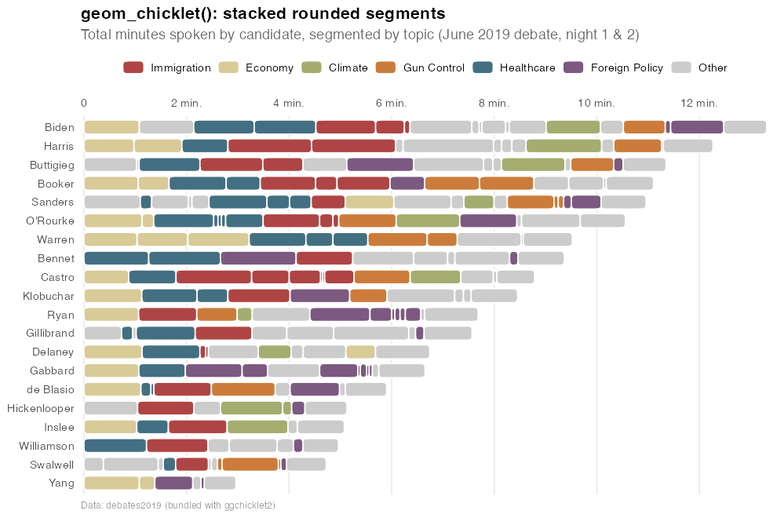
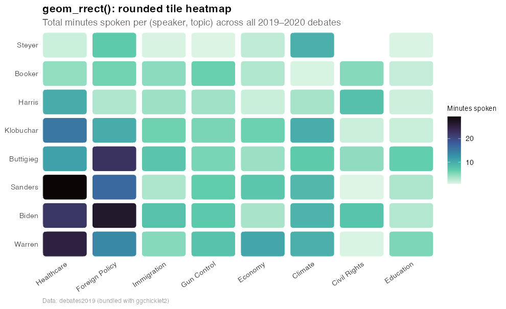
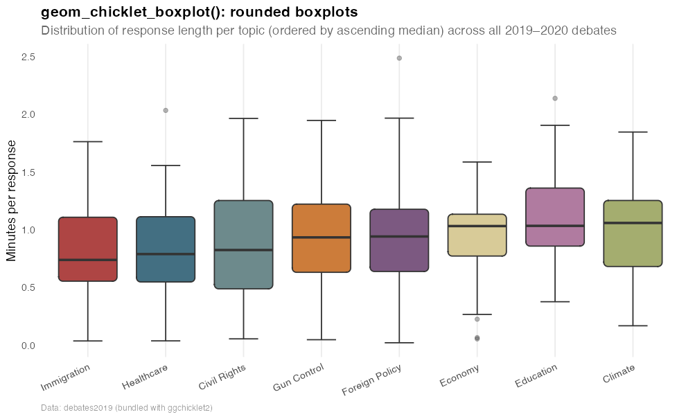
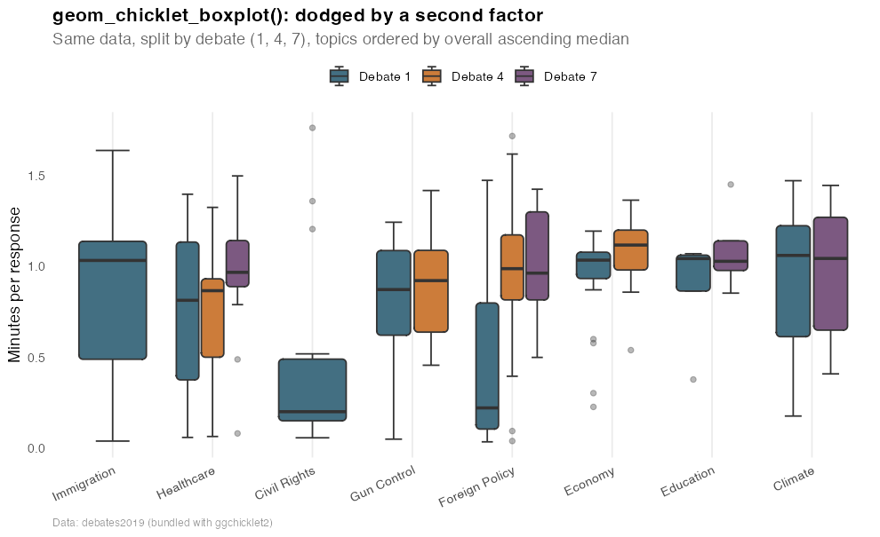
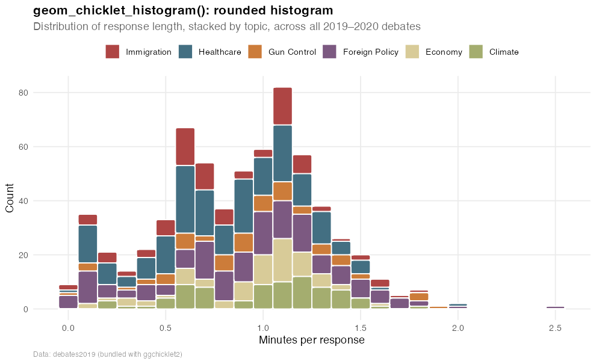

[](https://github.com/brooksbenard/ggchicklet2/actions/workflows/R-CMD-check.yaml)


# ggchicklet2

`ggchicklet2` is a friendly fork of Bob Rudis' excellent
[`ggchicklet`](https://github.com/hrbrmstr/ggchicklet) package that
extends rounded-rectangle ("chicklet") styling beyond stacked column
charts to additional `ggplot2` geoms.

## What's in the tin

| Function | What it does |
|---|---|
| `geom_chicklet()` | Stacked rounded segmented column chart (the original) |
| `geom_rrect()` | `geom_rect()` with rounded corners |
| `geom_chicklet_boxplot()` | **New.** Drop-in rounded replacement for `ggplot2::geom_boxplot()` (real `ggproto`, inherits from `GeomBoxplot`, uses `StatBoxplot`) |
| `geom_chicklet_histogram()` | **New.** Drop-in rounded replacement for `ggplot2::geom_histogram()` (real `ggproto`, inherits from `GeomBar`, uses `StatBin`) |
| `geom_chicklet_bar()` | **New.** Same geom as above with `stat = "count"` for discrete `x` — a rounded `geom_bar()` |
| `debates2019` | 2019–2020 U.S. Democratic Debate candidate × topic speaking times |

More rounded variants (`geom_chicklet_violin()`, `geom_chicklet_tile()`,
etc.) are on the roadmap.

## Installation

```r
remotes::install_github("brooksbenard/ggchicklet2")
```

## Visual tour

All examples below use the bundled `debates2019` dataset, so they're
fully reproducible after installing the package. The script that
generates these figures lives at
[`data-raw/build-readme-figures.R`](data-raw/build-readme-figures.R).

```r
library(ggplot2)
library(ggchicklet2)
data("debates2019")
```

### 1. `geom_chicklet()` — stacked rounded segments

A New York Times-style horizontal stacked bar chart, where each segment
represents one candidate response, ordered left-to-right by time.

```r
d1 <- subset(debates2019, debate_group == 1)
spk_order <- aggregate(elapsed ~ speaker, data = d1, sum)
d1$speaker <- factor(d1$speaker,
                     levels = spk_order$speaker[order(spk_order$elapsed)])
featured <- c("Immigration", "Economy", "Climate",
              "Gun Control", "Healthcare", "Foreign Policy")
d1$topic <- factor(ifelse(d1$topic %in% featured, d1$topic, "Other"),
                   levels = c(featured, "Other"))

ggplot(d1, aes(speaker, elapsed, group = timestamp, fill = topic)) +
  geom_chicklet(width = 0.75) +
  coord_flip() +
  theme_minimal()
```



### 2. `geom_rrect()` — rounded tile heatmap

`geom_rrect()` is a low-level rounded-rectangle building block. Drive it
with explicit `xmin`/`xmax`/`ymin`/`ymax` to get rounded heatmap tiles,
rounded annotation boxes, etc.

```r
top_spk <- names(sort(tapply(debates2019$elapsed, debates2019$speaker, sum),
                      decreasing = TRUE))[1:8]
top_top <- c("Healthcare", "Foreign Policy", "Immigration", "Gun Control",
             "Economy", "Climate", "Civil Rights", "Education")
agg <- aggregate(elapsed ~ speaker + topic,
                 data = subset(debates2019,
                               speaker %in% top_spk & topic %in% top_top),
                 sum)
agg$x <- as.integer(factor(agg$topic,   levels = top_top))
agg$y <- as.integer(factor(agg$speaker, levels = top_spk))

ggplot(agg) +
  geom_rrect(
    aes(xmin = x - 0.45, xmax = x + 0.45,
        ymin = y - 0.45, ymax = y + 0.45,
        fill = elapsed),
    radius = grid::unit(4, "pt"),
    colour = "white"
  ) +
  scale_x_continuous(breaks = seq_along(top_top), labels = top_top) +
  scale_y_continuous(breaks = seq_along(top_spk), labels = top_spk) +
  scale_fill_viridis_c(option = "mako", direction = -1) +
  theme_minimal()
```



### 3. `geom_chicklet_boxplot()` — rounded boxplots

A drop-in replacement for `ggplot2::geom_boxplot()` whose box body is
rendered as a rounded rectangle. Implemented as a real `ggproto`
inheriting from `GeomBoxplot` (and using `StatBoxplot` for stat
computation), so it composes with `aes()`, scales, faceting,
`position_dodge2()`, horizontal orientation (`coord_flip()` /
`orientation = "y"`), and all the modern boxplot customization knobs
(`outlier.*`, `whisker.*`, `staple.*`, `median.*`, `box.*`).

```r
box_topics <- c("Healthcare", "Foreign Policy", "Immigration", "Gun Control",
                "Economy", "Climate", "Civil Rights", "Education")
db <- subset(debates2019, topic %in% box_topics)
# Order topics on the x-axis by ascending median response length
db$topic <- reorder(factor(db$topic), db$elapsed, median, na.rm = TRUE)

ggplot(db, aes(topic, elapsed, fill = topic)) +
  geom_chicklet_boxplot(
    radius      = grid::unit(4, "pt"),
    staplewidth = 0.5,
    outlier.alpha = 0.35
  ) +
  theme_minimal()
```



### 4. `geom_chicklet_boxplot()` — dodged by a second factor

The same data, split by `debate_group`. The original list-of-layers
prototype broke in this case because dodging was based only on the x
variable; the real `ggproto` implementation picks up the secondary
grouping aesthetic automatically.

```r
db2 <- subset(debates2019,
              topic %in% box_topics & debate_group %in% c(1, 4, 7))
# Use the same overall-median ordering as the single-grouping plot
db2$topic        <- factor(db2$topic, levels = levels(db$topic))
db2$debate_group <- factor(paste0("Debate ", db2$debate_group))

ggplot(db2, aes(topic, elapsed, fill = debate_group)) +
  geom_chicklet_boxplot(
    radius      = grid::unit(3, "pt"),
    staplewidth = 0.5,
    outlier.alpha = 0.35
  ) +
  theme_minimal()
```



### 5. `geom_chicklet_histogram()` — rounded histograms

A drop-in replacement for `ggplot2::geom_histogram()` (and by extension
`geom_bar()`) that renders each bar as a rounded rectangle. Implemented
as a real `ggproto` (`GeomChickletHistogram`) inheriting from `GeomBar`
and using `StatBin` for stat computation, so it supports the full
bar/histogram aesthetic set, faceting, horizontal orientation
(`orientation = "y"`), and stack/dodge/identity positions.

```r
featured <- c("Healthcare", "Foreign Policy", "Immigration",
              "Gun Control", "Economy", "Climate")
dh <- subset(debates2019, topic %in% featured)
# Stack and legend order: ascending median response length
dh$topic <- reorder(factor(dh$topic), dh$elapsed, median, na.rm = TRUE)

ggplot(dh, aes(elapsed, fill = topic)) +
  geom_chicklet_histogram(
    binwidth = 0.1,
    colour   = "white",
    radius   = grid::unit(2, "pt")
  ) +
  theme_minimal()
```



For discrete `x` (count plots), use the convenience wrapper
`geom_chicklet_bar()`, which is identical to `geom_chicklet_histogram()`
but with `stat = "count"` instead of `"bin"`:

```r
ggplot(debates2019, aes(speaker)) +
  geom_chicklet_bar(fill = "#436f82", radius = grid::unit(2, "pt")) +
  coord_flip() +
  theme_minimal()
```

> **Note:** all four corners of every bar are rounded. For typical
> baseline-aligned histograms this lifts the bottom edges very slightly
> off the x-axis; reduce `radius` (e.g. `grid::unit(1, "pt")`) if that
> gap is visually distracting.

## Anywhere you currently use `geom_boxplot()`, you can drop in `geom_chicklet_boxplot()`

The signature mirrors `ggplot2::geom_boxplot()` exactly, with one
addition (`radius`) and one limitation (notched boxplots are not
supported — `notch = TRUE` is silently ignored because notch geometry is
incompatible with rounded corners). This means downstream packages that
introspect layer data (`ggsignif`, `ggpubr`, `ggrepel`, …) work without
modification.

## Relationship to upstream `ggchicklet`

This is a *renamed* fork, not just a branch. The original `ggchicklet`
package is unchanged and continues to be available from
[git.rud.is](https://git.rud.is/hrbrmstr/ggchicklet) and
[hrbrmstr/ggchicklet](https://github.com/hrbrmstr/ggchicklet) on GitHub.
`ggchicklet2` is intended for users who want the extended geom set and
modernized infrastructure (newer `ggplot2` baseline, GitHub Actions CI).

All original code, copyrights, and the MIT license from upstream are
preserved; Bob Rudis is credited as an author / copyright holder in
both `DESCRIPTION` and `LICENSE`.

## Code of Conduct

Please note that this project is released with a
[Contributor Code of Conduct](CONDUCT.md). By participating in this
project you agree to abide by its terms.
